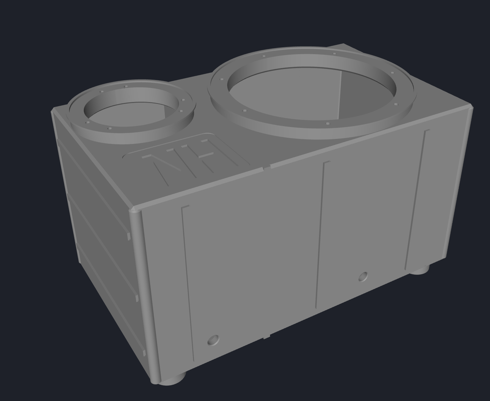
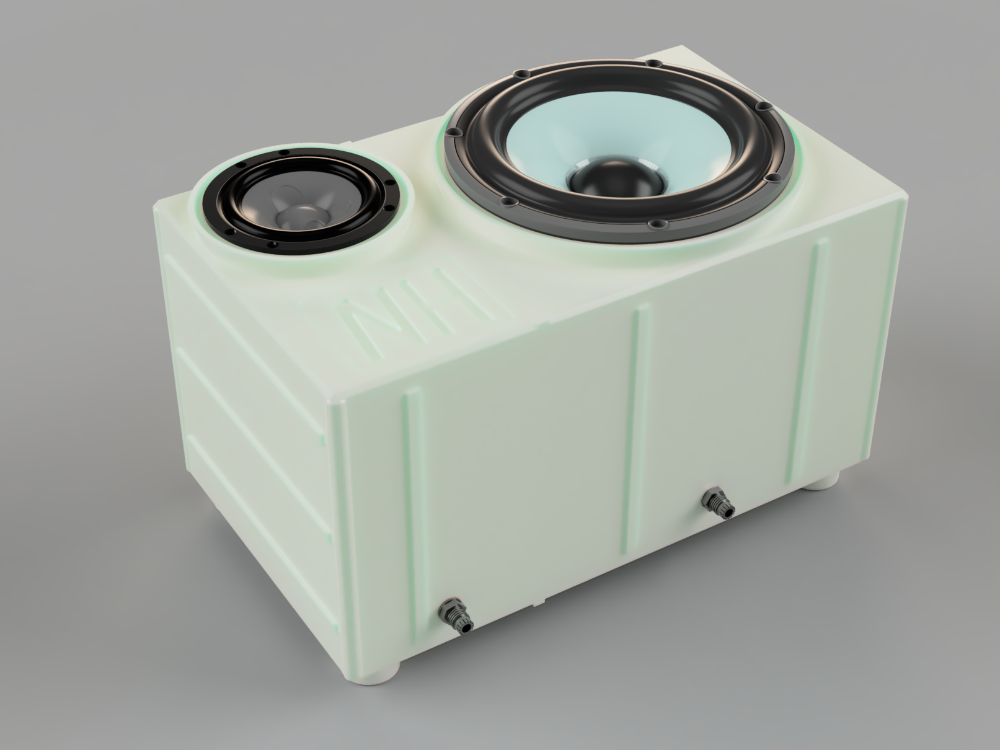

# Tesla Model 3 Rear-Cabin Speaker

A parametric, 3D-printable sealed speaker enclosure for the rear cabin floor behind the center console of a Tesla Model 3. The cabinet is modeled in [CodeCAD](https://codecad.xyz/) with Lua and designed for active DSP (woofer channel) and passive crossover (midrange/tweeter channel) use with the vehicle's 65W/4Ω amplifier outputs.

**Current System:** 3-driver mono loudspeaker (woofer + midrange + tweeter) with sealed chambers and removable, gasketed service panels for future modifications.

**Current Phase:** Fabrication readiness: inventory delivered hardware, commission the printer, and verify physical dimensions before revising or printing the enclosure.

For comprehensive project documentation, see the `docs/` folder: [PROJECT.md](docs/PROJECT.md), [REQUIREMENTS.md](docs/REQUIREMENTS.md), [WORK_HISTORY.md](docs/WORK_HISTORY.md), and [HARDWARE_SPECS.md](docs/HARDWARE_SPECS.md).

## Renders

Generated cabinet model:



Assembly render with both drivers and PG7 cable glands installed:



## Drivers

| Position | Driver                              | Impedance | Status                                   |
| -------- | ----------------------------------- | --------- | ---------------------------------------- |
| Woofer   | Scan-Speak Revelator 22W/4851T00    | 4 Ω       | Purchased                                |
| Midrange | Scan-Speak Illuminator 12MU/4731T00 | 4 Ω       | Purchased                                |
| Tweeter  | Scan-Speak Illuminator D3004/662000 | 4 Ω       | Working selection (verification pending) |

**Driver mounting:** Cutout sizes and frame dimensions are encoded in [parts/part.lua](parts/part.lua) and must be verified against physical drivers before a full-size print.

## Current Design

**System Architecture:**

- **Amplifier channel 1** → DSP low-pass + tuning → Woofer (dedicated sealed chamber)
- **Amplifier channel 2** → DSP high-pass + tuning → Passive midrange/tweeter crossover
  - Midrange and tweeter share the second amplifier output through a passive network
  - Crossover frequency: ~2.5 kHz (provisional, subject to measurement)

**Enclosure:**

- Sealed, two-chamber cabinet (separate woofer and midrange volumes) with isolated tweeter rear chamber
- Primarily one-piece large-format 3D-printed structural shell
- Removable, gasketed side-access panels for service access and future modifications
- Internal divider isolates midrange from woofer back-wave pressure
- Nominal dimensions: 241.3 mm (width) × 410 mm (length) × 220 mm (height)
- Generated STL envelope: 246.3 mm × 415 mm × 253.05 mm (preliminary)
- Preliminary chamber volumes: woofer ~12.04 L, midrange ~5.70 L (awaiting detailed analysis)

**Structural Features:**

- 8 mm enclosure walls with internal bracing and reinforcement ribs
- 12 mm raised driver baffles with trim rings
- Internal woofer chamber window brace with rounded opening
- Two 12.5 mm side-wall wire pass-throughs (sized for PG7 cable glands)
- Four Sorbothane-ready isolation feet (38.1 mm diameter, 19.05 mm tall)
- Flared foot collars and underside X cross-bracing for stiffness
- Low-relief exterior detail elements

**Current Milestone:** Complete one documented printer calibration print, then verify the physical drivers and vehicle envelope. The removable, gasketed side panel remains the next focused CAD revision; no full enclosure print should begin until those gates and feature coupons pass.

## Files

- `assets/` — Cabinet and assembly renders, reference CAD models
- `docs/` — Project documentation (PROJECT.md, REQUIREMENTS.md, WORK_HISTORY.md, HARDWARE_SPECS.md)
- `parts/` — Parametric CodeCAD model (part.lua)
- `scripts/` — Utility scripts
- `generated/` — Build outputs (STL and STEP files)
- `.claude/` — Claude Code configuration and project instructions (CLAUDE.md)
- `.obsidian/` — Obsidian vault configuration and settings
- `.luarc.json` — Lua language server configuration for IDE support
- `project.json` — CodeCAD project definition
- `AGENTS.md` — AI agent coordination and workflow documentation
- `imgui.ini` — CodeCAD ImGui layout and window state

## Build

This project uses millimeters. Install CodeCAD, then run these commands from
the repository root:

```bash
# Open CodeCAD's live viewer and reload the model on each save.
ccad live

# Export STL and STEP files to generated/.
ccad build

# Check the CodeCAD installation if needed.
ccad doctor
```

## Parameters

The editable values are grouped at the top of
[parts/part.lua](parts/part.lua). The most useful groups are:

- **Cabinet:** width, length, height, wall thickness, divider location, and
  window-brace dimensions.
- **Drivers:** cutout sizes, frame sizes, bolt geometry, and individual X/Y
  positions.
- **Isolation:** foot dimensions, collar flare, Sorbothane pocket, and bottom
  cross-brace dimensions.
- **Finish:** baffle trim rings, exterior rails, corner bumpers, and the
  recessed monogram badge.

All driver-related position changes move the baffle, main cutout, and its bolt
pattern together.

## Print And Assembly Notes

- Use this PLA+ design as a functional prototype. For sustained in-car use,
  prefer a higher-temperature material such as ASA, PETG, or another material
  appropriate to the vehicle's temperature range.
- Use closed-cell gasket tape under the driver frames and seal the wire exits
  with suitable grommets and flexible sealant. A sealed cabinet is sensitive to
  small air leaks.
- Fit 1.0625 in diameter by 0.25 in thick Sorbothane discs into the underside
  foot pockets. Select the Sorbothane durometer for the fully loaded cabinet
  weight and intended compression range.
- Line the woofer chamber walls with damping material. Add stuffing gradually
  after measurement; keep it clear of the woofer basket and vent.
- Line and moderately fill the isolated midrange chamber with suitable acoustic
  absorption to reduce internal reflections.
- The model includes structural braces, but print orientation, perimeter count,
  material choice, and infill should be chosen for a rigid, airtight enclosure.

## Status

This is a proof-of-concept enclosure intended for active tuning and in-car
measurement. Validate the final response, crossover settings, sealing, and
mechanical fit with the actual drivers before treating it as a permanent
installation. The printer, speakers, filament, tools, and related supplies have
been reported as delivered, but exact inventory and commissioning results are
not yet recorded. The immediate sequence is inventory → printer calibration →
physical driver and vehicle checks → focused feature coupons → full-print review.
