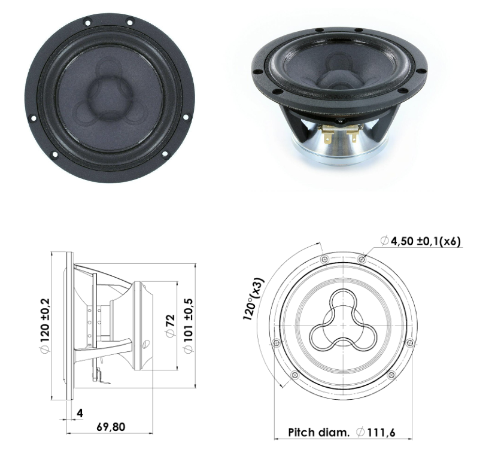
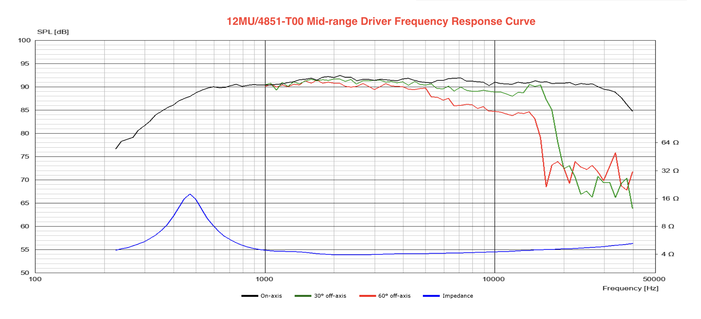
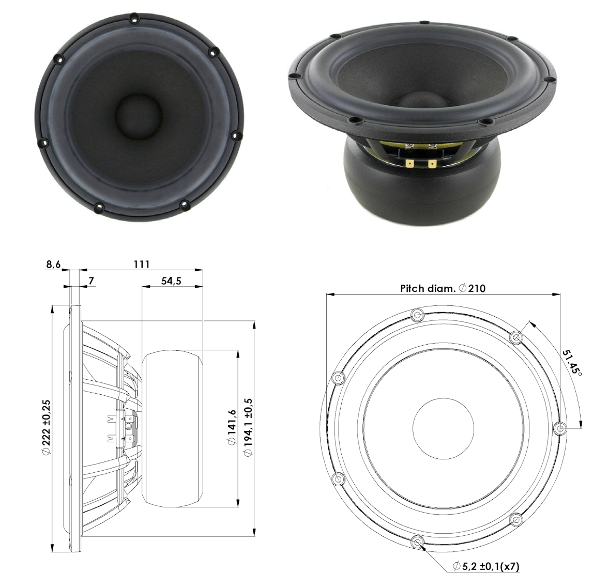
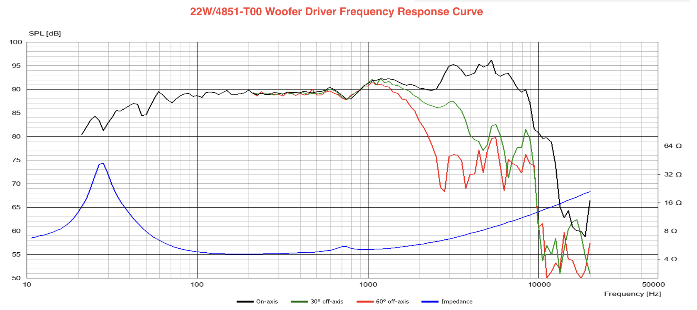
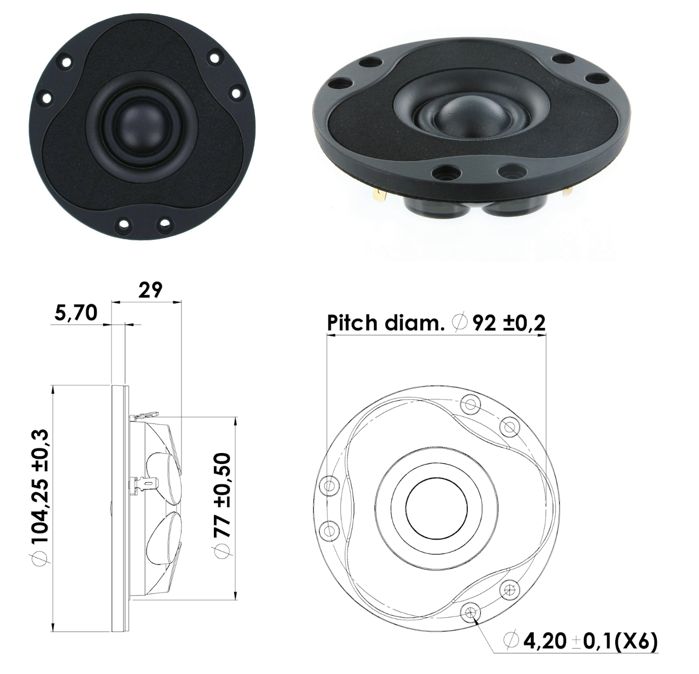
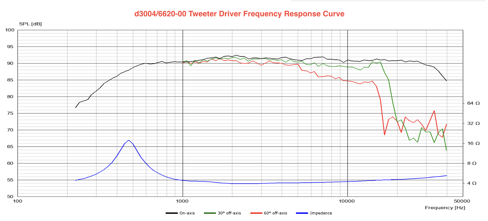

# Tesla Rear-Cabin Speaker - Hardware Specifications

## 1. Purpose and source status

This file is a convenient Markdown transcription of manufacturer specifications for the three intended Scan-Speak drivers. It is a reference, not a replacement for the original datasheets or physical measurements.

Primary sources:

- [Scan-Speak Illuminator 12MU/4731T00 datasheet](../assets/datasheets/12mu-4731t00.pdf)
- [Scan-Speak Revelator 22W/4851T00 datasheet](../assets/datasheets/22w-4851t00.pdf)
- [Scan-Speak Illuminator D3004/662000 datasheet](../assets/datasheets/d3004-662000.pdf)

Important interpretation rules:

- Manufacturer values describe representative production units under the manufacturer's test conditions.
- Nominal impedance is not a fixed resistance; actual impedance varies with frequency.
- Manufacturer response curves are useful design references but do not represent the response of these particular units in the project enclosure or vehicle.
- Manufacturer enclosure recommendations are examples, not automatically the correct alignments for this project.
- Physical driver dimensions, DC resistance, mounted response, and impedance shall still be measured or verified before the design is frozen.

## 2. Driver summary

| Role     | Driver                              | Nominal impedance | Sensitivity (2.83 V/1 m) | Recommended operating range | Linear excursion |
| -------- | ----------------------------------- | ----------------: | -----------------------: | --------------------------: | ---------------: |
| Midrange | Scan-Speak Illuminator 12MU/4731T00 |             4 ohm |                    90 dB |               100-10,000 Hz |       +/- 3.5 mm |
| Woofer   | Scan-Speak Revelator 22W/4851T00    |             4 ohm |                    89 dB |                 fs-3,000 Hz |         +/- 9 mm |
| Tweeter  | Scan-Speak Illuminator D3004/662000 |             4 ohm |                  91.5 dB |             2,500-30,000 Hz |       +/- 0.2 mm |

The sensitivity figures are not sufficient by themselves to set final relative levels. Baffle geometry, measurement distance, crossover losses, frequency-dependent response, and the vehicle installation will affect the required DSP and passive-network attenuation.

---

# 3. Scan-Speak Illuminator 12MU/4731T00 midrange

## 3.1 Thiele-Small parameters

| Parameter                    | Symbol |               Value |
| ---------------------------- | ------ | ------------------: |
| Resonance frequency          | fs     |               64 Hz |
| Mechanical Q factor          | Qms    |                3.64 |
| Electrical Q factor          | Qes    |                0.26 |
| Total Q factor               | Qts    |                0.24 |
| Force factor                 | Bl     |              5.1 Tm |
| Mechanical resistance        | Rms    |           0.60 kg/s |
| Moving mass                  | Mms    |               5.4 g |
| Compliance                   | Cms    |           1.15 mm/N |
| Effective diaphragm diameter | D      |               86 mm |
| Effective piston area        | Sd     |             58 cm^2 |
| Equivalent compliance volume | Vas    |               5.4 L |
| Sensitivity                  | -      | 90 dB at 2.83 V/1 m |

## 3.2 Mechanical data

| Parameter                    |      Value |
| ---------------------------- | ---------: |
| Voice-coil diameter          |      32 mm |
| Voice-coil height            |       6 mm |
| Voice-coil layers            |          4 |
| Gap height                   |      13 mm |
| Linear excursion             | +/- 3.5 mm |
| Maximum mechanical excursion |  +/- 10 mm |
| Unit weight                  |     0.8 kg |
| Cabinet displacement volume  |     0.14 L |

## 3.3 Electrical data

| Parameter             | Symbol |    Value |
| --------------------- | ------ | -------: |
| Nominal impedance     | Zn     |    4 ohm |
| Minimum impedance     | Zmin   |  4.3 ohm |
| Maximum impedance     | Zo     | 46.5 ohm |
| DC resistance         | Re     |  3.1 ohm |
| Voice-coil inductance | Le     |  0.11 mH |

## 3.4 Power handling

| Test or condition                 |                                        Value |
| --------------------------------- | -------------------------------------------: |
| 100-hour RMS noise test, IEC 18.4 |                                         80 W |
| Long-term maximum power, IEC 18.2 |                                        150 W |
| Manufacturer test crossover       | Second-order Butterworth high-pass at 200 Hz |

The power ratings are tied to the manufacturer's stated test conditions. They do not mean the driver can safely dissipate those powers with arbitrary signals, enclosure loading, or filters.

## 3.5 Manufacturer-listed key features

- Under-hung neodymium motor design
- Patented Symmetrical Drive (SD-3)
- One-piece cone and dust cap
- Low-loss linear suspension
- Very wide 100-10,000 Hz frequency response
- 90 dB output at 2.83 V

## 3.6 Manufacturer recommendations

| Item                      | Recommendation                              |
| ------------------------- | ------------------------------------------- |
| Operating frequency range | 100-10,000 Hz                               |
| Closed box example        | Vbox = 0.9 L; f(-3 dB) = 172 Hz             |
| Vented box example        | Vbox = 1.5 L; fb = 99 Hz; f(-3 dB) = 119 Hz |

## 3.7 Manufacturer response and impedance curves

Source-file caution: the PNG filename and title say `12MU/4851-T00`, but the project driver and source datasheet are `12MU/4731T00`. Treat the PNG as a crop of the 12MU/4731T00 datasheet unless a different source is later identified.

Qualitative reading only:

- The on-axis response is broadly near 90 dB through much of the midrange and remains extended well above the intended approximate 2.5 kHz midrange/tweeter transition.
- The 30-degree and especially 60-degree curves fall progressively below the on-axis curve as frequency rises, showing the expected narrowing directivity of a cone driver.
- The impedance peak near the driver's resonance and the rising high-frequency impedance confirm that the driver cannot be treated as an ideal 4-ohm resistor during passive-crossover design.
- The smooth response around the provisional crossover region makes approximately 2.5 kHz a plausible starting region, but the final acoustic target must come from measurements in the actual baffle.

---

# 4. Scan-Speak Revelator 22W/4851T00 woofer

## 4.1 Thiele-Small parameters

| Parameter                    | Symbol |               Value |
| ---------------------------- | ------ | ------------------: |
| Resonance frequency          | fs     |               21 Hz |
| Mechanical Q factor          | Qms    |                5.20 |
| Electrical Q factor          | Qes    |                0.23 |
| Total Q factor               | Qts    |                0.22 |
| Force factor                 | Bl     |              8.2 Tm |
| Mechanical resistance        | Rms    |           0.81 kg/s |
| Moving mass                  | Mms    |              32.5 g |
| Compliance                   | Cms    |           1.85 mm/N |
| Effective diaphragm diameter | D      |              167 mm |
| Effective piston area        | Sd     |            220 cm^2 |
| Equivalent compliance volume | Vas    |               126 L |
| Sensitivity                  | -      | 89 dB at 2.83 V/1 m |

## 4.2 Mechanical data

| Parameter                    |     Value |
| ---------------------------- | --------: |
| Voice-coil diameter          |     50 mm |
| Voice-coil height            |     24 mm |
| Voice-coil layers            |         2 |
| Gap height                   |      6 mm |
| Linear excursion             |  +/- 9 mm |
| Maximum mechanical excursion | +/- 14 mm |
| Unit weight                  |    3.6 kg |
| Cabinet displacement volume  |    1.04 L |

## 4.3 Electrical data

| Parameter             | Symbol |    Value |
| --------------------- | ------ | -------: |
| Nominal impedance     | Zn     |    4 ohm |
| Minimum impedance     | Zmin   |  4.5 ohm |
| Maximum impedance     | Zo     | 87.4 ohm |
| DC resistance         | Re     |  3.7 ohm |
| Voice-coil inductance | Le     |   0.3 mH |

## 4.4 Power handling

| Test or condition                 | Value |
| --------------------------------- | ----: |
| 100-hour RMS noise test, IEC 18.4 |  80 W |
| Long-term maximum power, IEC 18.2 | 200 W |
| Manufacturer test crossover       |  None |

The power ratings are tied to the manufacturer's stated test conditions. Safe output in this project also depends on enclosure volume, excursion, signal spectrum, DSP filtering, amplifier clipping, and thermal conditions.

## 4.5 Manufacturer-listed key features

- Patented Symmetrical Drive motor design
- Rigid paper cone
- Low-loss linear suspension
- Low-damping SBR rubber surround
- Die-cast aluminum chassis vented below the spider
- Ferrite magnet system with rubber boot

## 4.6 Manufacturer recommendations

| Item                      | Recommendation                            |
| ------------------------- | ----------------------------------------- |
| Operating frequency range | fs-3,000 Hz                               |
| Closed box example        | Vbox = 16 L; f(-3 dB) = 62 Hz             |
| Vented box example        | Vbox = 22 L; fb = 36 Hz; f(-3 dB) = 45 Hz |

## 4.7 Manufacturer response and impedance curves

Qualitative reading only:

- The on-axis response is broadly near the stated sensitivity through much of the low and middle frequency range.
- Stronger peaks and irregularities appear in the several-kilohertz region, while off-axis output narrows substantially as frequency increases. This supports keeping the woofer-to-midrange transition well below that region.
- The current project range of roughly 200-500 Hz for DSP crossover evaluation is acoustically conservative relative to the upper-frequency irregularities shown here.
- The resonance peak and rising inductive impedance reinforce the need to use measured impedance and modeled enclosure loading rather than a fixed 4-ohm assumption.

---

# 5. Scan-Speak Illuminator D3004/662000 tweeter

## 5.1 Thiele-Small parameters

| Parameter                    | Symbol |                 Value |
| ---------------------------- | ------ | --------------------: |
| Resonance frequency          | fs     |                500 Hz |
| Mechanical Q factor          | Qms    |                  3.79 |
| Electrical Q factor          | Qes    |                  0.62 |
| Total Q factor               | Qts    |                  0.54 |
| Force factor                 | Bl     |                2.3 Tm |
| Mechanical resistance        | Rms    |             0.29 kg/s |
| Moving mass                  | Mms    |                0.35 g |
| Compliance                   | Cms    |             0.29 mm/N |
| Effective diaphragm diameter | D      |                 30 mm |
| Effective piston area        | Sd     |                7 cm^2 |
| Equivalent compliance volume | Vas    |                0.02 L |
| Sensitivity                  | -      | 91.5 dB at 2.83 V/1 m |

## 5.2 Mechanical data

| Parameter                    |      Value |
| ---------------------------- | ---------: |
| Voice-coil diameter          |      26 mm |
| Voice-coil height            |     2.0 mm |
| Voice-coil layers            |          2 |
| Gap height                   |     2.5 mm |
| Linear excursion             | +/- 0.2 mm |
| Maximum mechanical excursion | +/- 1.6 mm |
| Unit weight                  |     0.3 kg |
| Cabinet displacement volume  |     0.12 L |

## 5.3 Electrical data

| Parameter             | Symbol |    Value |
| --------------------- | ------ | -------: |
| Nominal impedance     | Zn     |    4 ohm |
| Minimum impedance     | Zmin   |  3.9 ohm |
| Maximum impedance     | Zo     | 21.2 ohm |
| DC resistance         | Re     |  3.0 ohm |
| Voice-coil inductance | Le     |  0.03 mH |

## 5.4 Power handling

| Test or condition                 |                                         Value |
| --------------------------------- | --------------------------------------------: |
| 100-hour RMS noise test, IEC 18.4 |                                          90 W |
| Long-term maximum power, IEC 18.2 |                                         150 W |
| Manufacturer test crossover       | Second-order Butterworth high-pass at 2.5 kHz |

The published power ratings presume the stated filtering and manufacturer test conditions. The tweeter shall not be connected directly to an unfiltered full-range amplifier output.

## 5.5 Manufacturer-listed key features

- 1-inch textile-dome diaphragm
- Large-roll surround for wide dispersion
- Patented Symmetrical Drive (SD-2) motor
- AirCirc motor design with six neodymium magnets
- Diffraction-damping rubber front
- Die-cast, rubber-painted aluminum faceplate

## 5.6 Manufacturer recommendations

| Item                      | Recommendation  |
| ------------------------- | --------------- |
| Operating frequency range | 2,500-30,000 Hz |
| Closed box example        | Not applicable  |
| Vented box example        | Not applicable  |

## 5.7 Manufacturer response and impedance curves

Qualitative reading only:

- The on-axis response is broadly level through most of the intended high-frequency band before rolling off in the top octave.
- The 30-degree and 60-degree curves show progressively reduced high-frequency output off axis. Tweeter aiming and listening-position geometry will therefore matter in the vehicle.
- The prominent impedance peak near 500 Hz matches the stated resonance region.
- A 2.5 kHz crossover is approximately five times the nominal resonance frequency and matches the manufacturer's stated test filter, but the project still requires a measurement-derived acoustic crossover and safe passive protection.

---

# 6. Transcription and naming notes

- The user-provided woofer transcription listed Qes as `0.20`; the rendered manufacturer PDF shows `0.23`.
- The woofer Cms value was initially read from the rendered PDF as `0.85 mm/N`; subsequent user verification established the correct value as `1.85 mm/N`.
- The user-provided midrange transcription rounded Le to `0.1 mH`; the rendered manufacturer PDF shows `0.11 mH`.
- Scan-Speak product naming appears in both compact and hyphenated forms. These are not always consistent on the Scan-Speak website, but can be treated as equivalent. This document uses the compact datasheet model names `12MU/4731T00`, `22W/4851T00`, and `D3004/662000` as canonical identifiers.
- The frequency-response PNGs are convenient crops for human reference. The original PDFs remain the primary manufacturer sources.

# 7. Project implications

These specifications reinforce, but do not newly freeze, the current architecture:

- The woofer-to-midrange transition should remain in DSP so it can be tuned without a large low-frequency passive network.
- The midrange/tweeter passive crossover should be designed from mounted acoustic response and impedance measurements, with approximately 2.5 kHz remaining a provisional starting region.
- The current approximately 5.70 L gross midrange chamber is much larger than the manufacturer's 0.9 L closed-box example and requires deliberate revision or validation.
- The current approximately 12.04 L gross woofer chamber is smaller than the manufacturer's 16 L closed-box example and requires sealed-alignment modeling using final net volume.
- Published power-handling values do not supersede the project's conservative commissioning, filtering, impedance, and limiter requirements.
